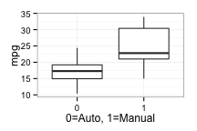
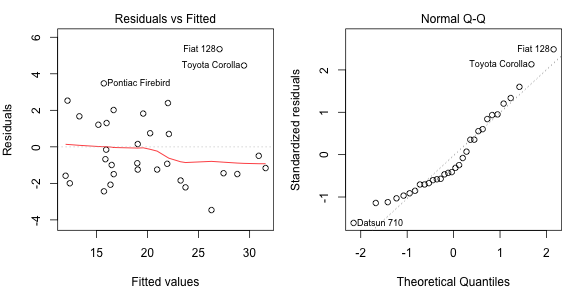

## Context  

You work for Motor Trend, a magazine about the automobile industry. Looking at a data set of a collection of cars, they are interested in exploring the relationship between a set of variables and miles per gallon (MPG) (outcome). They are particularly interested in the following two questions:  

- "Is an automatic or manual transmission better for MPG”  
- "Quantify the MPG difference between automatic and manual transmissions"  

## Executive Summary  
Based on the model created in this analysis, take MPG as outcome, the predictors include weight, number of cylinders, transmission type, and the interaction between weight and transmission type. Manual transmission has better MPG than auto. The MPG difference could be approximately quantified as: With weight and number of cylinders being equal, a car with manual transmission will have an improved MPG in the value of 11.9 minus 2.4 times the weight of car divided by 1,000, subtract the number of cylinders mutiplied by 1.2, further subtract 4.2 times the weight divided by 1,000, finally plus 34.3.  

## Full Analysis  

#### Exploratory Data Analysis  
First, load the data and examine the data strucutre (Figure 1). Looks like among 32 observations, it is fairely an even split between two groups in question (19 auto, 13 manual). Now create a boxplot to examine which one has better MPG on average (Figure 2). The boxplot indicates that manual transmission has better MPG than auto.    

#### Model Selection  
*Forward-Selection* model selection strategy is used here. First, create a basic model with a single variable: transmission type (am) (Figure 3).  

This model has an Estimate **p-value lower than 0.05**, thus proving there is a linear correlation between type of transmission to MPG.  

Next, we add one more predictor into this model. The next most likely one is weight (wt) (Figure 4).  Model 2's **coefficients all have low p-values**; it also has a better **Adjusted R-squared value**, suggesting both predictors need to be included in the final model.  

For Model 3, test if there is an interaction between transmission type and weight (Figure 5). Assumpetion is true. We also have reached a better **Ajusted R-squared value 0.815** while maintaining **low p-vlaues for all coefficients**.   

Now another predictor will be added: cylinder number (cyl) (Figure 6). **Low p-values, better Adjusted R-squared value as 0.853**. All the above predictors need to be selected. There also is no interaction between wt and cyl (Figure 7); but there is an interaction between cyl and am (Figure 8), however the **Adjusted R-squared value** is not as high as **0.853**.    

Adding the rest of the varaibles one by one and examine the coefficents p-values as well as if Adjusted R-squared improves, we cannot find any other predictors that improves the current model (process omitted from this analysis). Our final model is Model 4 in Figure 6:  


```r
fit4 <- lm(mpg ~ am*wt + cyl, mtcars)
```

#### Residuals examination  
Figure 9 exmmines the residuals vs. fitted values, as well as standardized residuals theoretical quantiles. The conclusions is there does not seem to be significant outliers other than three instances (the ones noted in the graph).  

#### Confidence Intervals  


```r
coef <- summary(fit4)$coef
coef <- data.frame(coef)
interval <- function(r) {
    r[1] + c(-1,1) * qt(.975, 27) * r[2]
}
t(apply(coef, 1, interval))
```

```
##                  [,1]       [,2]
## (Intercept) 28.545155 40.0208405
## am           4.048559 19.8284725
## wt          -4.060457 -0.6774023
## cyl         -1.961674 -0.4010575
## am:wt       -6.888512 -1.5063563
```


#### Answers to the Questions  

- "Is an automatic or manual transmission better for MPG”  
Because the coefficient for **am** is **positive (11.9385)**, and am takes 1 as the value for manual, **manual transmission** is better for MPG.  

- "Quantify the MPG difference between automatic and manual transmissions"  
With weight and number of cylinders being equal, a car with manual transmission will have an improved MPG in the value of **11.9385 minus 2.3689 times the weight of car divided by 1,000, subtract the number of cylinders mutiplied by 1.1814, further subtract 4.1974 times the weight divided by 1,000, finally plus 34.2830.** (refer to figure 6's coefficients)   


## Appendix

### Figure 1  

```r
head(mtcars, n=3)
```

```
##                mpg cyl disp  hp drat    wt  qsec vs am gear carb
## Mazda RX4     21.0   6  160 110 3.90 2.620 16.46  0  1    4    4
## Mazda RX4 Wag 21.0   6  160 110 3.90 2.875 17.02  0  1    4    4
## Datsun 710    22.8   4  108  93 3.85 2.320 18.61  1  1    4    1
```

```r
## how many cobservations
nrow(mtcars)
```

```
## [1] 32
```

```r
## the distribution between two kinds of transmissions
table(mtcars$am)
```

```
## 
##  0  1 
## 19 13
```

### Figure 2  

```r
library(ggplot2)
ggplot(mtcars, aes(as.factor(am), mpg)) + geom_boxplot() + theme_bw() + labs(x="0=Auto, 1=Manual")
```

 

### Figure 3  


```r
fit1 <- lm(mpg ~ am, mtcars)
summary(fit1)$coef
```

```
##              Estimate Std. Error   t value     Pr(>|t|)
## (Intercept) 17.147368   1.124603 15.247492 1.133983e-15
## am           7.244939   1.764422  4.106127 2.850207e-04
```

```r
summary(fit1)$adj.r.squared
```

```
## [1] 0.3384589
```

### Figure 4  


```r
fit2 <- lm(mpg ~ am + wt, mtcars)
summary(fit2)$coef
```

```
##                Estimate Std. Error     t value     Pr(>|t|)
## (Intercept) 37.32155131  3.0546385 12.21799285 5.843477e-13
## am          -0.02361522  1.5456453 -0.01527855 9.879146e-01
## wt          -5.35281145  0.7882438 -6.79080719 1.867415e-07
```

```r
summary(fit2)$adj.r.squared
```

```
## [1] 0.7357889
```

### Figure 5  


```r
fit3 <- lm(mpg ~ am*wt, mtcars)
summary(fit3)$coef
```

```
##              Estimate Std. Error   t value     Pr(>|t|)
## (Intercept) 31.416055  3.0201093 10.402291 4.001043e-11
## am          14.878423  4.2640422  3.489277 1.621034e-03
## wt          -3.785908  0.7856478 -4.818836 4.551182e-05
## am:wt       -5.298360  1.4446993 -3.667449 1.017148e-03
```

```r
summary(fit3)$adj.r.squared
```

```
## [1] 0.8151486
```

### Figure 6 - FINAL MODEL    


```r
fit4 <- lm(mpg ~ am*wt + cyl, mtcars)
summary(fit4)$coef
```

```
##              Estimate Std. Error   t value     Pr(>|t|)
## (Intercept) 34.282998  2.7964507 12.259468 1.518742e-12
## am          11.938516  3.8453256  3.104683 4.438319e-03
## wt          -2.368930  0.8243992 -2.873523 7.815636e-03
## cyl         -1.181366  0.3802985 -3.106417 4.419268e-03
## am:wt       -4.197434  1.3115498 -3.200362 3.496375e-03
```

```r
summary(fit4)$adj.r.squared
```

```
## [1] 0.8587759
```

### Figure 7  


```r
fit5 <- lm(mpg ~ am*wt + cyl*wt, mtcars)
summary(fit5)$coef
```

```
##                Estimate Std. Error    t value   Pr(>|t|)
## (Intercept) 31.93034090 16.1464125  1.9775502 0.05867096
## am          12.98800292  8.0997757  1.6035016 0.12090441
## wt          -1.60442842  5.2323464 -0.3066365 0.76156235
## cyl         -0.87890918  2.0796154 -0.4226306 0.67603965
## am:wt       -4.53101524  2.6197284 -1.7295744 0.09556325
## wt:cyl      -0.09787432  0.6611812 -0.1480295 0.88346154
```

```r
summary(fit5)$adj.r.squared
```

```
## [1] 0.8534677
```

### Figure 8  

```r
fit6 <- lm(mpg ~ am*wt + cyl*am, mtcars)
summary(fit6)$coef
```

```
##               Estimate Std. Error    t value     Pr(>|t|)
## (Intercept) 34.5680688  2.8786700 12.0083470 4.127484e-12
## am          11.6776786  3.9234021  2.9764165 6.231780e-03
## wt          -2.2280342  0.8725637 -2.5534344 1.687769e-02
## cyl         -1.2988334  0.4391468 -2.9576290 6.521476e-03
## am:wt       -5.1746064  2.2000002 -2.3520936 2.651858e-02
## am:cyl       0.5098372  0.9148842  0.5572696 5.821095e-01
```

```r
summary(fit6)$adj.r.squared
```

```
## [1] 0.8550752
```

### Figure 9


```r
par(mfrow = c(1,2), mar = c(4, 4, 2, 1))
plot(fit4, which=1)
plot(fit4, which=2)
```

 
